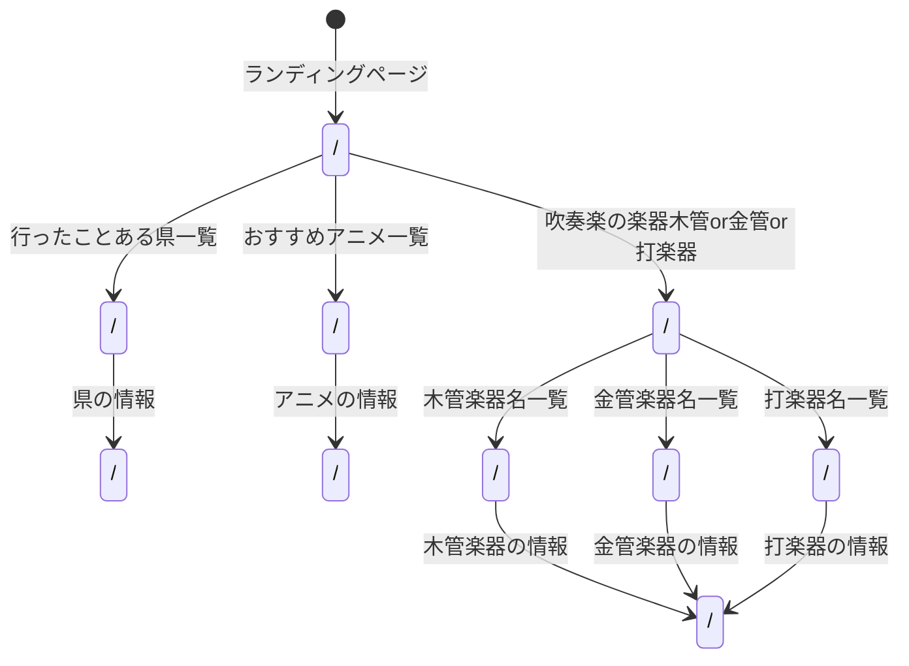

```mermaid
stateDiagram-v2
[*]-->entry:ランディングページ
entry:/

entry-->ken:行ったことある県一覧
entry-->anime:おすすめアニメ一覧
entry-->gakki:吹奏楽の楽器木管or金管or打楽器
ken:/
anime:/
gakki:/

ken-->info:県の情報
anime-->ani:アニメの情報
gakki-->moku:木管楽器名一覧
gakki-->kin:金管楽器名一覧
gakki-->da:打楽器名一覧
info:/
ani:/
moku:/
kin:/
da:/

moku-->/:木管楽器の情報
kin-->/:金管楽器の情報
da-->/:打楽器の情報

```

# 行ったことがある県
1. 県名
2. 地方
3. 観光地
4. 県庁所在地
5. 東京からの行き方
6. 東京からの所要時間

# あすすめアニメ
1. 作品名
2. 原作
3. ジャンル
4. 完結済みか
5. シーズン数
6. 制作会社

# 吹奏楽の楽器
1. 楽器名
2. 属
3. 音域
4. 調性
5. 代表曲
6. 材質